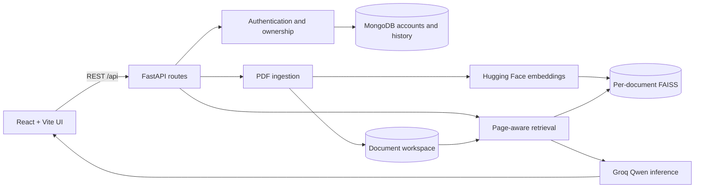

# PdfSense

PdfSense turns text-based PDFs into isolated, searchable AI workspaces. Upload a document, ask grounded questions with page citations, create summaries, and generate MCQs or flashcards from the same source.

The application is built as a portfolio-ready RAG system: each document owns its files and FAISS index, embeddings are generated through Hugging Face hosted inference, and citations are attached from retrieved metadata instead of trusting the language model to invent page numbers.

## Features

- Safe PDF-only upload with a configurable 25 MB limit
- Page-aware PyMuPDF extraction and recursive text chunking
- UUID workspaces that keep same-named documents isolated across restarts
- Hosted `mixedbread-ai/mxbai-embed-large-v1` embeddings
- One persisted FAISS cosine-similarity index per document
- Grounded Groq chat using `qwen/qwen3.6-27b`
- Server-owned page citations with expandable source excerpts
- Hierarchical brief and detailed summaries for long documents
- Validated MCQs and flashcards with a single malformed-output retry
- Responsive React workspace with useful loading and error states
- Email/password accounts with Argon2 hashing and signed HTTP-only sessions
- MongoDB-backed document ownership, daily quotas, and saved chat history
- Structured JSON request logs, centralized service errors, and health checks

## Architecture



See [Architecture](docs/architecture.md) for service boundaries, persistence, request flows, and design decisions.

## Tech stack

| Layer | Technology |
|---|---|
| Frontend | React, Vite, Tailwind CSS, Axios |
| API | FastAPI, Pydantic, Uvicorn |
| PDF processing | PyMuPDF, LangChain text splitters |
| Embeddings | Hugging Face Inference API, mxbai-embed-large-v1 |
| Vector search | FAISS `IndexFlatIP` over normalized vectors |
| Generation | Groq API, qwen/qwen3.6-27b |
| Accounts | MongoDB, PyMongo, Argon2, signed JWT sessions |
| Tests | unittest, FastAPI TestClient, Vitest, Testing Library |

## Local setup

Prerequisites: Python 3.12 or newer, Node.js 20 or newer, MongoDB, a Hugging Face token with inference access, and a Groq API key.

### 1. Backend

```powershell
cd backend
python -m venv .venv
.\.venv\Scripts\Activate.ps1
pip install -r requirements-dev.txt
Copy-Item .env.example .env
```

Set `HF_TOKEN`, `GROQ_API_KEY`, `MONGODB_URI`, and a random `JWT_SECRET_KEY` of at least 32 characters in `backend/.env`, then start the API. The example URI expects MongoDB on `localhost:27017`; `docker compose up -d mongodb` starts that dependency when Docker is available.

When using MongoDB Atlas, copy the Python driver connection string from Atlas. If you substitute credentials manually, percent-encode reserved characters in the username or password; an unescaped `@`, `:`, `/`, `?`, `#`, `[`, or `]` makes the URI invalid.

```powershell
uvicorn app.main:app --reload --port 8000
```

Swagger UI is available at `http://localhost:8000/docs`. The real `.env` file is ignored by Git; never commit provider tokens.

### 2. Frontend

In a second terminal:

```powershell
cd frontend
npm install
npm run dev
```

Open `http://localhost:5173`. Vite proxies `/api` requests to the local FastAPI server. Set `VITE_API_BASE_URL` from `frontend/.env.example` only when the API is hosted elsewhere.

### Run the production image locally

Make sure Docker Desktop is running and `backend/.env` contains both provider keys plus `JWT_SECRET_KEY`:

```powershell
docker compose up --build
```

Open `http://localhost:7860`. Compose starts MongoDB and the application, while the image builds React, installs only backend runtime dependencies, serves both through FastAPI, runs as an unprivileged UID 1000 user, and includes a liveness health check. Named Docker volumes preserve accounts, chat history, uploaded documents, and indexes between local container recreations.

To stop it:

```powershell
docker compose down
```

Add `--volumes` only when you intentionally want to delete the locally persisted document workspaces.

## Quality checks

Normal tests mock external AI providers, so they are deterministic and do not spend API quota.

```powershell
cd backend
.\.venv\Scripts\python.exe -m unittest discover -s tests -v
.\.venv\Scripts\ruff.exe check app tests

cd ..\frontend
npm test
npm run lint
npm run build
```

Live provider tests are opt-in. Enable only the test you intend to run after configuring the real keys:

```powershell
$env:RUN_LIVE_EMBEDDING_API_TEST = "1"
$env:RUN_LIVE_RAG_API_TEST = "1"
$env:RUN_LIVE_SUMMARY_API_TEST = "1"
$env:RUN_LIVE_STUDY_API_TEST = "1"
```

Then run the backend suite again. These checks call Hugging Face and/or Groq and may consume quota.

## API overview

| Method | Endpoint | Purpose |
|---|---|---|
| `GET` | `/api/health` | Process liveness |
| `GET` | `/api/health/ready` | Storage, database, authentication, and provider readiness |
| `POST` | `/api/auth/register` | Create an account and signed session |
| `POST` | `/api/auth/login` | Start a signed session |
| `POST` | `/api/auth/logout` | Clear the browser session |
| `GET` | `/api/auth/me` | Read the current user and quota usage |
| `POST` | `/api/upload` | Ingest and index one PDF |
| `GET` | `/api/documents` | List local document workspaces |
| `GET` | `/api/documents/{id}` | Read document metadata |
| `DELETE` | `/api/documents/{id}` | Remove document and vector workspaces |
| `POST` | `/api/documents/{id}/search` | Retrieve ranked page-aware chunks |
| `POST` | `/api/chat` | Ask a grounded question and receive citations |
| `GET` | `/api/documents/{id}/chat-history` | Load saved conversation turns |
| `DELETE` | `/api/documents/{id}/chat-history` | Clear one saved conversation |
| `POST` | `/api/summary` | Generate a brief or detailed summary |
| `POST` | `/api/study` | Generate validated MCQs and flashcards |

Service failures use a stable envelope:

```json
{
  "detail": "Document not found.",
  "code": "document_not_found"
}
```

## Project layout

```text
PdfSense/
├── backend/
│   ├── app/
│   │   ├── core/       # configuration, errors, logging
│   │   ├── routes/     # thin HTTP handlers
│   │   └── services/   # ingestion, indexing, retrieval, generation
│   ├── tests/
│   ├── uploads/        # ignored runtime document workspaces
│   └── vector_store/   # ignored per-document FAISS indexes
├── frontend/
│   └── src/
│       └── components/
└── docs/
```

## Current scope

PdfSense currently targets PDFs with extractable text. OCR and background ingestion jobs remain outside the current scope. Authentication is intentionally lightweight: local email/password accounts, owner-scoped documents, persisted chat history, and configurable per-user quotas; email verification, password recovery, social login, billing, and administrator tooling are future work.

## Deploy to Hugging Face Spaces

1. Create a new Hugging Face Space and choose **Docker** as the SDK.
2. Push this repository to the Space repository. The README metadata selects port `7860`, and the root `Dockerfile` is discovered automatically.
3. Provision an external MongoDB deployment and add its connection string as the `MONGODB_URI` Space Secret. A Space runs this Dockerfile as one container, so the local Compose MongoDB service is not part of a Space deployment.
4. In the Space **Settings**, add `HF_TOKEN`, `GROQ_API_KEY`, `MONGODB_URI`, and a strong random `JWT_SECRET_KEY` as **Secrets**, never Variables. Set `AUTH_COOKIE_SECURE=true` as a Variable.
5. Optionally add non-sensitive settings such as `MONGODB_DATABASE`, `MAX_UPLOAD_MB`, `GROQ_MODEL`, or `LOG_LEVEL` as Variables.
6. Wait for the image build and open the Space. Check `/api/health/ready` if the UI reports missing configuration.

Hugging Face injects Docker Space secrets as runtime environment variables, so they are never copied into the image. See the official [Docker Spaces guide](https://huggingface.co/docs/hub/en/spaces-sdks-docker).

MongoDB preserves accounts, ownership records, quotas, and conversations, but Space disk is ephemeral, so uploaded PDFs and FAISS indexes can disappear when a Space restarts. For durable documents, use persistent Space storage or external object storage and point `UPLOAD_DIR` and `VECTOR_STORE_DIR` at durable mount paths; see the official [Spaces storage guide](https://huggingface.co/docs/hub/spaces-storage).

The application uses Hugging Face hosted inference. No embedding weights are downloaded into the container, so there is no model cache to prewarm or persist.
