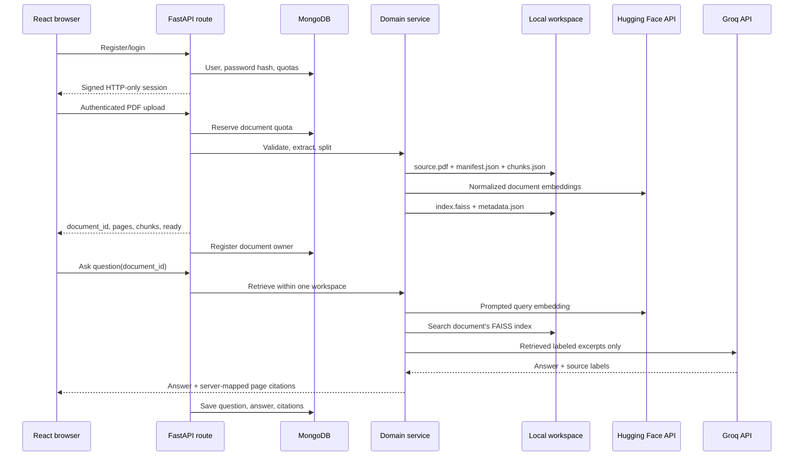

# PdfSense Architecture

## Design goals

PdfSense separates HTTP handling, document processing, retrieval, and generation so that each part can be tested without a live provider. The main integrity boundary is the `document_id`: every stored chunk and every vector row belongs to exactly one UUID workspace.

## Runtime components



### Routes

Routes in `backend/app/routes/` validate public request and response shapes, then call one service operation. Provider and storage exceptions reach the centralized handler in `app/core/errors.py`, which converts them to stable HTTP statuses and public error codes.

### Services

- `pdf_service.py` validates uploads, extracts text page by page, chunks it, persists the workspace, and coordinates indexing.
- `document_service.py` owns safe workspace paths, manifests, chunks, document listing, and deletion.
- `embedding_service.py` owns the Hugging Face client, batching, query prompting, vector shape checks, and normalization.
- `vector_service.py` builds and reloads one `IndexFlatIP` per document and validates row metadata.
- `retrieval_service.py` embeds a question and returns ranked chunks from only the requested document.
- `rag_service.py` labels retrieved sources, validates Groq's answer schema, and maps accepted labels back to stored page metadata.
- `summary_service.py` reduces long documents through bounded hierarchical batches.
- `study_service.py` validates structured MCQs and flashcards and retries malformed model output once.
- `llm_service.py` owns the cached Groq client and translates SDK failures into domain exceptions.
- `account_service.py` owns MongoDB users, document ownership, atomic quota updates, and bounded chat history.
- `auth_service.py` owns email normalization, Argon2 password verification, and signed access tokens.

### Core infrastructure

- `config.py` loads typed runtime settings from `backend/.env`.
- `errors.py` is the single service-exception-to-HTTP mapping table.
- `logging.py` emits JSON request events and adds an `X-Request-ID` response header.
- `dependencies.py` resolves the repository and authenticates bearer tokens or the signed HTTP-only session cookie.
- `/api/health` is a liveness check. `/api/health/ready` checks local storage, MongoDB connectivity, JWT configuration, and both provider keys; it does not spend provider quota.

## Persistence model

Uploading a document with UUID `<document_id>` creates:

```text
backend/uploads/<document_id>/
├── source.pdf
├── manifest.json
└── chunks.json

backend/vector_store/<document_id>/
├── index.faiss
└── metadata.json
```

`chunks.json` retains the page number and chunk position. FAISS metadata maps each integer vector row back to its chunk ID, text excerpt, and page. Manifests become `ready` only after indexing succeeds. A failed ingestion removes partial document and vector workspaces.

MongoDB stores users, document-to-owner records, quota counters, and chat turns. The PDF, chunks, and vector data remain in isolated filesystem workspaces. Ownership is checked before any workspace is read, and unknown or foreign UUIDs both return `404`. Durable shared object storage is still necessary before horizontal scaling.

Document-slot reservations and daily AI usage increments are atomic MongoDB updates. A failed upload releases its reservation and cleans partial workspaces. Daily AI counters reset by UTC date. Deleting a document removes its local artifacts, ownership record, quota usage, and saved conversation.

## Retrieval and citation integrity

Both document and query vectors are normalized. FAISS inner-product ranking therefore acts as cosine similarity. Search is performed against the path derived from the requested UUID, never a shared global index.

The LLM sees retrieved excerpts labeled `S1`, `S2`, and so on. It may return only those labels. PdfSense rejects unknown labels and creates citations from stored metadata. Page numbers are therefore not generated by the model.

## Failure behavior

- Client input: `413`, `415`, or `422`
- Missing/invalid authentication: `401`; exhausted quotas: `429`
- Missing or not-ready documents: `404` or `409`
- Missing provider configuration: `503`
- Provider limits: `429`
- Provider timeouts, failures, or invalid responses: `502`
- Local storage or processing failures: `500`

Every service error returns `detail` for humans and `code` for clients. Structured logs include request ID, method, path, status, and duration without logging PDF contents or API keys.

## Test boundaries

Backend unit and integration tests patch provider calls while exercising actual PDF parsing, persistence, FAISS indexing, authentication, ownership, chat history, routes, and error mapping. Separate opt-in live tests validate Hugging Face and Groq credentials. Frontend component tests mock the REST adapter and verify login, chat citations, summary options, and interactive study material. A final quality gate runs backend tests and lint plus frontend tests, lint, and the production build.

## Production container

The root Dockerfile has separate React and Python dependency build stages. The final Debian slim image contains the compiled frontend, the backend package, and a prebuilt Python virtual environment. FastAPI mounts the frontend only when `static/index.html` exists, so local backend development remains API-only while the production container serves a single same-origin application.

The runtime listens on `HOST` and `PORT`, defaults to Space port `7860`, runs as UID 1000, and uses `/health` for its Docker liveness check. Provider credentials enter only through runtime environment variables. The hosted embedding architecture means the image contains no model weights or model cache.
